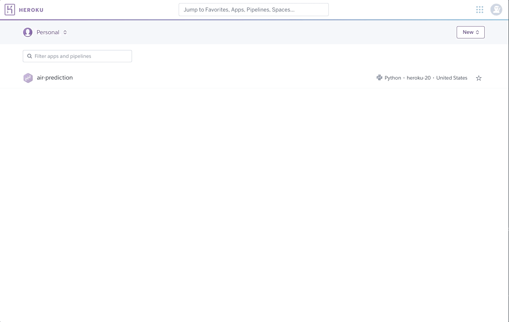

# titanic
A machine learning program, built from scratch. Motivated by Kaggle's datasets. 

## Overview

Dear all, this is alegendary dataset which you must have known. If you are new to this dataset, welcome and take a look at the application and the code to understand and learn the process of building an end to end data science project. 

## Details

In the application or let's say project, a machine learning algorithm is used which predicts the survival of the passengers who travelled on the Titanic. This prediction is deployed on a web application where you can run the program based on the data you input. 

In this app, the details you enter in the form will be considered as a ticket to board the Titanic. You will experience as if you are actually buying the ticket to travel. Take a look at the [website](https://anildhage-titanic.herokuapp.com).

## Motivation

I like to data science work actually. The only way I could become better and better at it is by learning constantly and applying the skills. I picked this project because a few months ago I worked on this dataset while doing the kaggle competition. That competion only required pre-processing, building the model and finding the accuracy. I thought I'd deploy that dataset on the web for everyone to experience. I couldn't do as I was occupied with work, etc. A few days ago I remembered, completed it today while I write this readme.md file.


## Demo


## Project Status

Completed. However, there are a few things that can be improved. I will discuss below

## Needs of the project // Contribution

As you may have noticed that this project is almost complete but there are a many more things that can be improved. Feel free to add functionalities and add more features if it can make the app more better.

	1. CSS for designing pages 
	2. There is a bug where if you enter something else in the ticket form instead of what is required, the app crashes. I understand it should have been fixed but I wanted to get back to other things that requires my most attention.
	3. I have used bootstrap and less, actually very less CSS. Just an FYI
	4. And many things can be improved, such as connecting a database such as SQLAlchemy, saving the prediction result in some csv or pdf, and many more. The list would go on and on.
	5. I would encourage you to participate and improve the code and bugs in this project as it might help you and me in our developing/programming career.

### Contribution: 

Everyone can contribute here. I'm sure the super busy guys and girls may not have time, but if you are learning and love open source contribution because of the benefits it can bring you and in your career, then go ahead and send pull requests. 

## Hactoberfest 2021

Contribute to open source, learn and earn prizes. This fest is valid from 1st to 31st October. 

## Machine Learning Model 

1. Decision Tree Classifier

## Methods Used

1. Data gathering was easy as the dataset is easily available on the internet
2. File size was very small it didn't require a lot of space
3. Feature Engineering: Removing nans, outliers, dropping columns
4. Explanatory Data Analysis: Graphs, charts to understand the data
5. Feature Selection
6. Model Building
7. Model Deployment

## Tech Stack used

1. Python libraries, pandas, matplotlib, scikit, numpy, seaborn
2. Flask - Web Framework
3. wtf-forms
4. HTML/CSS/Bootstrap
5. Heroku 

## Deployment on Heroku 




## Run this program on your computer

1. Fork this repository
2. Create a new environment for this project using conda or any environment tool that you are used to
3. After cloning the repository, copy its Http link by clicking on *Code*
4. Open terminal, chose the path where you want this program to be saved and run  ``` git clone 'paste the Https link' ```
5. From terminal enter in to the projects directory then run this code that will install the dependencies required for this program ``` pip install -r requirements.txt ```
4. After the downloads, run the below this code that will start the program on your local server ``` python app.py ```
5. In the terminal, find the server link. Open it in your browser.  


## Feedback

If you have any feedback, please reach out to me at i.am.dhage@gmail.com or if you want to share a like, please hit a star to this project

## ## License

[MIT](https://github.com/anildhage/titanic/blob/main/LICENSE)

